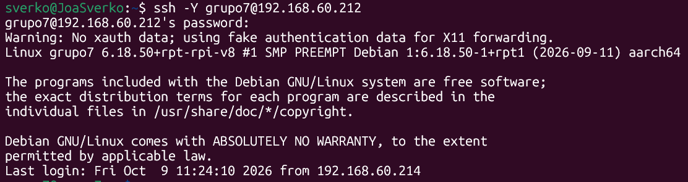
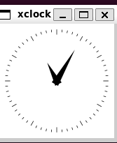

# SEGUNDA ENTREGA - XORG Y REDIRECCIÓN GRÁFICA MEDIANTE SSH

**Alumnos:** Candiotto Gino, Joaquin Sverko, Genaro Correa, Facundo Angelelli  
**Fecha:** 10 de octubre  
**Tema:** Instalación de Xorg y configuración de X11 Forwarding mediante SSH

---

## 1. INTRODUCCIÓN

En la primera entrega se instaló Raspberry Pi OS Lite (64-bit) en la Raspberry Pi y se configuró el servicio SSH para poder administrar el dispositivo de manera remota desde otra computadora.

En esta segunda entrega se continuó trabajando sobre esa instalación. El objetivo fue instalar el servidor gráfico **Xorg**, sin incorporar un gestor de ventanas ni un entorno de escritorio, y habilitar la redirección de aplicaciones gráficas a través de SSH.

Esta configuración permite ejecutar una aplicación en la Raspberry Pi y visualizar su ventana en la computadora cliente. De esta manera, la Raspberry Pi ejecuta el programa, mientras que la ventana gráfica se muestra en el equipo desde el cual se estableció la conexión remota.

Para realizar la práctica se trabajó con Linux como sistema cliente y se utilizó una conexión SSH con la opción `-Y`, ya que fue la modalidad que permitió ejecutar correctamente la aplicación gráfica de prueba.

---

## 2. OBJETIVOS DE LA PRÁCTICA

Los objetivos principales de esta entrega fueron:

- Instalar los paquetes necesarios para disponer de Xorg y ejecutar aplicaciones gráficas de prueba.
- Mantener la Raspberry Pi sin un entorno de escritorio completo.
- Configurar el servicio SSH para permitir la redirección gráfica mediante X11 Forwarding.
- Conectarse desde una computadora con Linux a la Raspberry Pi.
- Comprobar que una aplicación gráfica ejecutada en la Raspberry Pi se visualice en la computadora cliente.

---

## 3. ¿QUÉ ES XORG?

**Xorg** es una implementación del sistema de ventanas X Window System, utilizado en sistemas Unix y Linux para proporcionar la infraestructura necesaria para mostrar aplicaciones gráficas.

Permite que los programas gráficos creen ventanas y dibujen elementos visuales mediante el sistema X11.

En esta práctica se instaló Xorg como parte de una configuración mínima. La consigna no requiere instalar un escritorio completo, por lo que no se incorporó un entorno como GNOME, KDE o XFCE ni un gestor de ventanas.

Es importante distinguir los siguientes componentes:

- **Xorg:** servidor gráfico que proporciona la infraestructura para mostrar gráficos en una sesión local.
- **Gestor de ventanas:** programa que controla aspectos como la posición, el tamaño y los bordes de las ventanas.
- **Entorno de escritorio:** conjunto de herramientas gráficas que suele incluir paneles, menús, utilidades y aplicaciones.
- **Aplicación gráfica:** programa que presenta una interfaz visual, como un reloj o una aplicación de prueba.

Por lo tanto, instalar Xorg no significa instalar automáticamente un escritorio completo.

---

## 4. ¿QUÉ ES X11 FORWARDING?

**X11 Forwarding** es una función de SSH que permite redirigir la comunicación gráfica de una aplicación remota hacia la computadora cliente.

En lugar de abrir la ventana en un monitor conectado directamente a la Raspberry Pi, la aplicación se ejecuta en la Raspberry Pi y su interfaz se muestra en la computadora desde la que nos conectamos.

Esta función resulta útil para utilizar aplicaciones gráficas de un equipo remoto sin tener que instalar un entorno de escritorio completo en ese equipo.

En nuestro caso, la Raspberry Pi funciona como servidor remoto y la computadora con Linux como cliente.

### Esquema de funcionamiento


COMPUTADORA CLIENTE CON LINUX
          |
          | Conexión SSH con X11 Forwarding
          | ssh -Y usuario@IP_DE_LA_RASPBERRY
          v
      RASPBERRY PI
          |
          | Ejecuta la aplicación gráfica
          v
  Aplicación de prueba (xeyes)
          |
          | La interfaz se redirige mediante SSH
          v
La ventana se muestra en la computadora cliente
```

---
## 5. DIFERENCIA ENTRE XORG Y X11 FORWARDING

Aunque ambos conceptos están relacionados con las aplicaciones gráficas, no cumplen la misma función.

**Xorg** es un servidor gráfico que forma parte de la infraestructura gráfica del sistema. Por otro lado, **X11 Forwarding** es una función de SSH que permite transportar la comunicación gráfica de una aplicación remota hasta el cliente.

En esta práctica, el objetivo no fue iniciar un escritorio gráfico completo en la Raspberry Pi. Se buscó ejecutar una aplicación gráfica de manera remota y visualizarla en la computadora cliente a través de SSH.

---

## 6. INSTALACIÓN DE LOS PAQUETES NECESARIOS

Para preparar la Raspberry Pi se actualizaron los índices de paquetes y se instalaron los componentes necesarios para la práctica.

Primero se ejecutó:

```bash
sudo apt update
```

Este comando actualiza la información que el sistema utiliza para conocer las versiones disponibles de los paquetes.

Luego se instalaron los paquetes necesarios:

```bash
sudo apt install --no-install-recommends xorg xauth x11-apps
```

Los componentes instalados cumplen distintas funciones:

- **`xorg`:** proporciona los componentes del servidor gráfico Xorg.
- **`xauth`:** permite gestionar la autenticación utilizada por las conexiones X11.
- **`x11-apps`:** incluye aplicaciones gráficas sencillas que sirven para realizar pruebas.
- **`--no-install-recommends`:** evita instalar automáticamente los paquetes recomendados que no sean dependencias necesarias.

Esta instalación se realizó con el objetivo de contar con los componentes requeridos para la actividad, sin agregar deliberadamente un gestor de ventanas ni un entorno de escritorio completo.

---

## 7. CONFIGURACIÓN DEL SERVICIO SSH

Para que SSH permita la redirección de aplicaciones gráficas, es necesario comprobar la configuración del servidor SSH en la Raspberry Pi.

Se abrió el archivo de configuración con:

```bash
sudo nano /etc/ssh/sshd_config
```

Dentro del archivo se revisaron las directivas relacionadas con X11 Forwarding(que no tengan # al principio):

```text
X11Forwarding yes
X11DisplayOffset 10
X11UseLocalhost yes
```

Estas opciones tienen las siguientes funciones:

- **`X11Forwarding yes`:** habilita la redirección gráfica mediante SSH.
- **`X11DisplayOffset 10`:** establece el desplazamiento inicial utilizado para asignar los números de pantalla a las sesiones X11 reenviadas.
- **`X11UseLocalhost yes`:** hace que el extremo local del reenvío X11 se vincule a la interfaz de loopback del servidor, en lugar de exponerse a otras interfaces de red.

Se verificó que las opciones estuvieran configuradas correctamente y sin el símbolo `#` al comienzo de la línea, ya que ese símbolo indica que la línea está comentada.

Después de guardar los cambios, se reinició el servicio SSH para aplicar la configuración:

```bash
sudo systemctl restart ssh
```

---

## 8. CONEXIÓN DESDE LA COMPUTADORA CON LINUX

A diferencia de la primera entrega, en la que la conexión SSH se realizaba desde Windows, para esta práctica se utilizó una computadora con Linux como cliente.

La conexión se estableció mediante el siguiente formato:

```bash
ssh -Y usuario@IP_DE_LA_RASPBERRY
```

Se debe reemplazar `usuario` por el nombre del usuario configurado en la Raspberry Pi y `IP_DE_LA_RASPBERRY` por la dirección IP real del dispositivo.

La opción `-Y` habilita el reenvío X11 con confianza extendida. Durante nuestras pruebas, esta fue la opción que permitió que la aplicación gráfica funcionara correctamente.


**Importante:** la opción `-Y` concede a las aplicaciones gráficas remotas un nivel de confianza mayor que `-X`. Por eso debe utilizarse únicamente cuando se confía en el equipo remoto y en las aplicaciones que se ejecutan en él.

---

## 9. COMPROBACIÓN DE LA VARIABLE DISPLAY

Una vez establecida la conexión SSH con reenvío X11, se comprobó el valor de la variable de entorno `DISPLAY`:

```bash
echo $DISPLAY
```

Esta variable indica a las aplicaciones gráficas dónde deben enviar la información de visualización.

Cuando el reenvío X11 está configurado correctamente, SSH establece automáticamente un valor para esta variable en la sesión remota. Puede aparecer un valor similar a:

```text
localhost:10.0
```

El número concreto puede variar. Lo importante es que la variable esté definida durante la sesión SSH con reenvío gráfico habilitado.

Esta comprobación permite verificar que la sesión tiene configurado un destino para las aplicaciones gráficas, aunque por sí sola no garantiza que todas las aplicaciones vayan a ejecutarse correctamente.

---

## 10. PRUEBA DE UNA APLICACIÓN GRÁFICA

Para comprobar el funcionamiento se utilizó una aplicación gráfica incluida en el paquete `x11-apps`.

Se ejecutó:

```bash
xeyes
```

`xeyes` es una aplicación sencilla que muestra una ventana con dos ojos que siguen el movimiento del puntero. Se utiliza como prueba básica de que una aplicación X11 puede abrir una ventana.

La aplicación se ejecutó desde la sesión SSH establecida con la opción `-Y`. El resultado esperado es que la ventana de `xeyes` aparezca en la computadora cliente con Linux, aunque el comando se haya ejecutado en la Raspberry Pi.

También se puede utilizar otra aplicación de prueba del mismo paquete, como:

```bash
xclock
```

`xclock` muestra un reloj en una ventana gráfica.

Estas aplicaciones sirven para comprobar la redirección gráfica, no para instalar un entorno de escritorio completo.

---
## 11. VISUALIZACIÓN DE APLICACIONES GRÁFICAS EN EL MONITOR DE LA RASPBERRY PI

Además de mostrar aplicaciones gráficas en la computadora cliente mediante SSH, también es posible ejecutar aplicaciones gráficas directamente en el monitor conectado a la Raspberry Pi.

Para realizar esto, se preparó una sesión gráfica local utilizando Xorg, sin instalar un gestor de ventanas ni un entorno de escritorio completo.

### 11.1. Comprobar la variable DISPLAY

Primero se comprobó el valor de la variable de entorno `DISPLAY` mediante el siguiente comando:

```bash
echo $DISPLAY
```

El comando no devolvió ningún valor, lo que indicó que la terminal utilizada no tenía configurado un destino gráfico mediante esa variable.

### 11.2. Instalar las herramientas necesarias

Para disponer de las herramientas necesarias para iniciar una sesión gráfica X, se ejecutaron los siguientes comandos:

```bash
sudo apt update
sudo apt install xinit x11-xserver-utils
```

* **`xinit`:** permite iniciar una sesión del sistema gráfico X.
* **`x11-xserver-utils`:** incluye herramientas auxiliares para trabajar con X11.

Estos paquetes permitieron preparar el inicio de una sesión gráfica mínima, manteniendo el objetivo de no instalar un entorno de escritorio completo.

### 11.3. Ejecutar xclock en el monitor

Una vez instaladas las herramientas, se utilizó el siguiente comando para iniciar la aplicación gráfica `xclock` en la pantalla local:

```bash
startx /usr/bin/xclock -- :0
```

En este comando, `/usr/bin/xclock` indica la ubicación de la aplicación y `:0` identifica la pantalla X local que se desea utilizar.

Mediante este procedimiento se buscó iniciar Xorg y ejecutar la aplicación gráfica directamente en el monitor conectado a la Raspberry Pi, sin necesidad de utilizar la redirección gráfica de SSH.

### 11.4. Resultado de la prueba

La prueba permitió comprobar el procedimiento de inicio de una aplicación gráfica local mediante Xorg. La aplicación `xclock` se utiliza para visualizar un reloj en una ventana gráfica y verificar el funcionamiento del sistema X11.

De esta manera, se diferencia la ejecución gráfica local de la redirección X11 mediante SSH, en la cual la ventana aparece en la computadora cliente.

### 11.5. Diferencia entre la visualización local y la redirección SSH

Existen dos modalidades para mostrar aplicaciones gráficas:

* **Mediante SSH con X11 Forwarding:** la aplicación se ejecuta en la Raspberry Pi, pero la ventana se muestra en la computadora cliente. En nuestras pruebas se utilizó `ssh -Y`.
* **Mediante una sesión Xorg local:** la aplicación se ejecuta en la Raspberry Pi y su ventana se muestra en el monitor conectado directamente a ella.

Ambas modalidades permiten trabajar con aplicaciones gráficas, pero utilizan diferentes destinos de visualización.

## 12. COMANDOS UTILIZADOS

### Actualizar la información de paquetes

```bash
sudo apt update
```

Actualiza los índices de paquetes disponibles.

### Instalar los componentes gráficos y las aplicaciones de prueba

```bash
sudo apt install --no-install-recommends xorg xauth x11-apps
```

Instala los paquetes necesarios para la práctica sin instalar automáticamente los paquetes recomendados.

### Editar la configuración de SSH

```bash
sudo nano /etc/ssh/sshd_config
```

Abre el archivo de configuración del servidor SSH.

### Reiniciar SSH

```bash
sudo systemctl restart ssh
```

Reinicia el servicio para aplicar la configuración modificada.

### Conectarse con redirección gráfica

```bash
ssh -Y usuario@IP_DE_LA_RASPBERRY
```

Establece una sesión SSH con reenvío X11 de confianza extendida.

### Consultar la variable DISPLAY

```bash
echo $DISPLAY
```

Permite comprobar el destino gráfico configurado para la sesión remota.

### Ejecutar la aplicación gráfica de prueba

```bash
xeyes
```
 
Abre una aplicación X11 sencilla para verificar el reenvío gráfico.

Como alternativa:

```bash
xclock
```


Abre una ventana con un reloj.

---

## 13. RESULTADO FINAL

Al finalizar la práctica se configuró la Raspberry Pi para permitir la ejecución de aplicaciones gráficas mediante una conexión SSH con X11 Forwarding.

Los puntos principales de la configuración fueron:

- Se instalaron los paquetes necesarios para la práctica de Xorg.
- Se mantuvo el objetivo de trabajar sin un gestor de ventanas ni un entorno de escritorio completo.
- Se revisó la configuración de SSH para permitir X11 Forwarding.
- Se utilizó una computadora con Linux como cliente.
- Se comprobó la variable `DISPLAY` dentro de la sesión remota.
- La opción `ssh -X` no funcionó durante nuestras pruebas.
- La conexión mediante `ssh -Y` permitió ejecutar correctamente la aplicación gráfica de prueba.

De esta forma, se pudo utilizar una aplicación gráfica ejecutada en la Raspberry Pi y visualizar su ventana en la computadora cliente, sin tener que abrir un escritorio completo en la Raspberry Pi.

---

## 14. CONCLUSIÓN

En esta segunda entrega se continuó el trabajo iniciado con la instalación de Raspberry Pi OS Lite y la configuración de SSH. El objetivo fue incorporar los componentes necesarios para ejecutar aplicaciones gráficas de manera remota, manteniendo una instalación mínima y sin instalar un entorno de escritorio ni un gestor de ventanas.

Para lograrlo, se instalaron Xorg, `xauth` y las aplicaciones de prueba de X11. También se revisaron las opciones del servidor SSH relacionadas con la redirección gráfica y se reinició el servicio para aplicar los cambios.

La conexión se realizó desde una computadora con Linux. Aunque la opción `-X` no funcionó en nuestras pruebas, la opción `-Y` permitió ejecutar la aplicación gráfica y mostrar su ventana en el equipo cliente.

Esta práctica permitió comprender la diferencia entre disponer de un servidor gráfico, instalar un entorno de escritorio y redirigir una aplicación gráfica a través de SSH. Como resultado, la Raspberry Pi puede seguir utilizándose como servidor sin necesidad de contar con un escritorio completo para realizar esta prueba.

