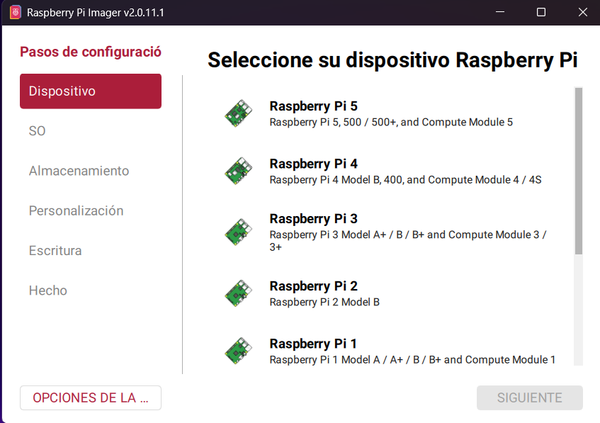
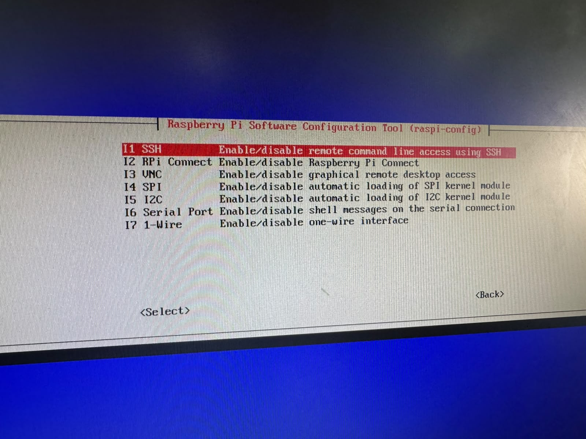
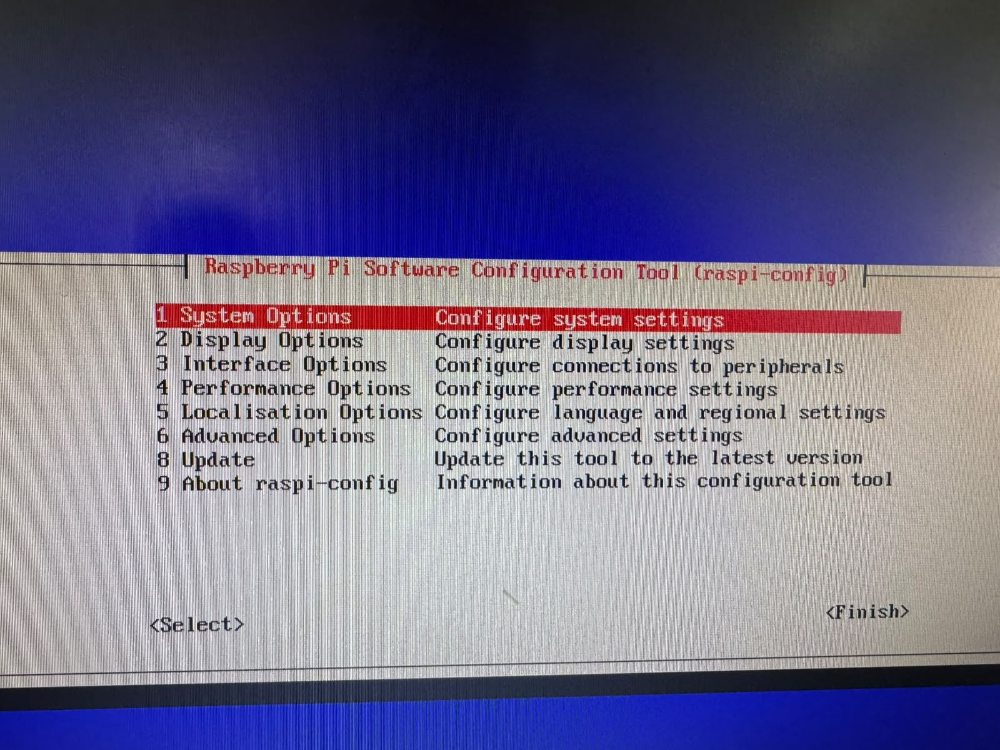
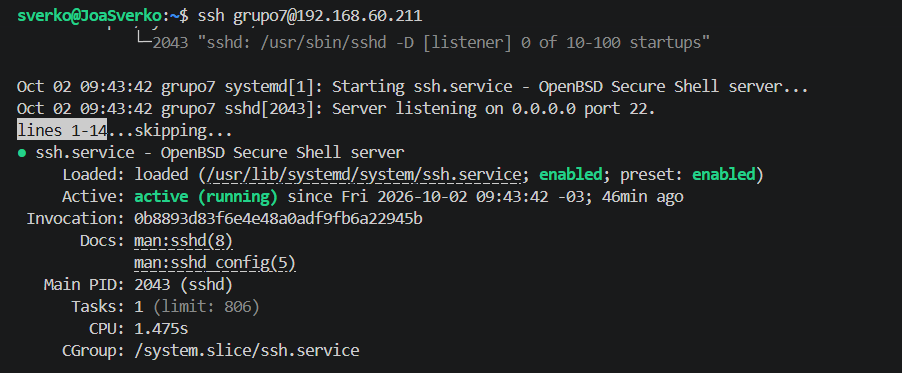

# PRIMERA ENTREGA - RASPBERRY PI Y SSH

**Alumnos:** Candiotto Gino, Joaquin Sverko, Genaro Correa, Facundo Angelelli  
**Fecha:** 10 de octubre  
**Tema:** Instalación del sistema operativo y configuración de SSH  
!
---

## 1. INTRODUCCIÓN

El objetivo de esta primera entrega es investigar y realizar la instalación desde cero del sistema operativo de una Raspberry Pi, con la finalidad de utilizarla posteriormente como un servidor para brindar distintos servicios dentro de una red local.

Además de instalar el sistema operativo, se configuró el servicio **SSH** (*Secure Shell*). Este servicio permite conectarse de manera remota a la Raspberry Pi desde otra computadora mediante una conexión segura, sin necesidad de conectar físicamente un monitor, teclado o mouse al dispositivo.

Para esta práctica se utilizó **Raspberry Pi OS Lite (64-bit)**, una versión del sistema operativo que no incluye entorno gráfico de escritorio y que resulta adecuada para utilizar la Raspberry Pi como servidor.

---

## 2. ¿QUÉ ES UNA RASPBERRY PI?

Una Raspberry Pi es una computadora de pequeñas dimensiones desarrollada originalmente por la *Raspberry Pi Foundation*. A pesar de su tamaño reducido, posee los componentes necesarios para ejecutar un sistema operativo y realizar numerosas tareas informáticas.

Dependiendo del modelo, una Raspberry Pi puede disponer de:

* Procesador
* Memoria RAM
* Puertos USB
* Puerto HDMI
* Conexión Ethernet
* Wi-Fi
* Bluetooth
* GPIO (*General Purpose Input/Output*)
* Ranura para tarjeta microSD

La tarjeta microSD se utiliza habitualmente como medio de almacenamiento donde se instala el sistema operativo.

La Raspberry Pi puede utilizarse para diferentes finalidades, por ejemplo:

* Servidores web
* Servidores de archivos
* Servidores DNS
* Automatización
* Redes
* Domótica
* Proyectos educativos
* Desarrollo de aplicaciones
* Administración de servicios dentro de una red local

En este proyecto se utilizará como base para posteriormente implementar diferentes servicios de red.

---

## 3. SISTEMA OPERATIVO

Un sistema operativo (SO) es el software principal que permite administrar los recursos de una computadora y proporcionar una interfaz para que el usuario pueda utilizarla.

Entre sus funciones se encuentran:

* Administrar el procesador.
* Administrar la memoria.
* Administrar los dispositivos de almacenamiento.
* Administrar las conexiones de red.
* Gestionar archivos y directorios.
* Ejecutar programas y servicios.
* Controlar dispositivos conectados.

En una Raspberry Pi existen diferentes sistemas operativos compatibles. Uno de los principales es **Raspberry Pi OS**, basado en Debian.

---

## 4. RASPBERRY PI OS

Raspberry Pi OS es el sistema operativo oficial desarrollado para las computadoras Raspberry Pi.

Existen diferentes variantes del sistema operativo. Para esta práctica se seleccionó:

> **Raspberry Pi OS Lite (64-bit)**

La versión *Lite* se caracteriza por no incluir un entorno gráfico de escritorio. Esto significa que la interacción con el sistema se realiza principalmente mediante una terminal de comandos.

Esta característica es especialmente útil cuando la Raspberry Pi se utiliza como servidor, ya que no es necesario consumir recursos del sistema en una interfaz gráfica que no resulta necesaria para administrar los servicios.

---

## 5. ¿QUÉ ES UN ENTORNO DE ESCRITORIO?

Un entorno de escritorio es una interfaz gráfica que permite utilizar el sistema operativo mediante ventanas, iconos, menús y otros elementos visuales.

Por ejemplo, un sistema con escritorio permite:

* Abrir ventanas.
* Utilizar un explorador de archivos.
* Ejecutar aplicaciones gráficas.
* Utilizar menús.
* Configurar el sistema mediante interfaces visuales.

En esta práctica el entorno de escritorio **no debe instalarse**, porque la Raspberry Pi será utilizada como servidor. En lugar de utilizar una interfaz gráfica, se administrará mediante una terminal y, posteriormente, mediante SSH.

---

## 6. ¿QUÉ ES UN SERVIDOR?

Un servidor es un equipo que proporciona servicios o recursos a otros dispositivos llamados **clientes** dentro de una red.

Por ejemplo, un servidor puede proporcionar:

* Archivos
* Páginas web
* Bases de datos
* Servicios DNS
* Servicios DHCP
* Acceso remoto

En este proyecto la Raspberry Pi funcionará como una computadora destinada a ejecutar servicios para otros dispositivos de la red local.

---

## 7. ¿QUÉ ES SSH?

**SSH** significa *Secure Shell*. Es un protocolo de red que permite establecer una conexión remota y segura con otro equipo.

Mediante SSH es posible conectarse a la Raspberry Pi desde otra computadora y utilizar su terminal como si se estuviera trabajando directamente sobre ella.

Sintaxis general:
```bash
ssh usuario@direccion_ip
```

Si la Raspberry Pi tiene la dirección IP `192.168.1.25` y el usuario es `grupo7`, la conexión puede realizarse mediante:
```bash
ssh grupo7@192.168.1.25
```

---

## 8. ¿PARA QUÉ SIRVE SSH?

SSH permite administrar un equipo remotamente. En este proyecto resulta especialmente útil porque permite administrar la Raspberry Pi sin necesidad de conectar:

* Monitor
* Teclado
* Mouse

La Raspberry puede permanecer conectada a la red y nosotros podemos utilizar otra computadora para acceder a ella. Esto es muy habitual en servidores, ya que muchas veces estos equipos funcionan sin una interfaz gráfica y se administran exclusivamente mediante conexiones remotas.

---

## 9. ¿POR QUÉ SSH ES SEGURO?

SSH utiliza mecanismos de autenticación y cifrado para proteger la comunicación entre el cliente y el servidor.

Cuando un usuario se conecta mediante SSH:

1. El cliente intenta establecer una conexión con el servidor.
2. El servidor se identifica.
3. Se establece una comunicación protegida.
4. El usuario se autentica.
5. Una vez autenticado, puede utilizar la terminal remotamente.

De esta manera, la información que se intercambia durante la sesión está protegida frente a una simple transmisión sin cifrado.

---

## 10. CLIENTE Y SERVIDOR SSH

En una conexión SSH intervienen dos partes:

* **CLIENTE SSH:** Es el dispositivo desde el cual se realiza la conexión. *(En nuestro caso: PC con Windows)*
* **SERVIDOR SSH:** Es el dispositivo al cual nos conectamos. *(En nuestro caso: Raspberry Pi)*

La comunicación queda representada de la siguiente manera:

```text
PC con Windows
      |
      | SSH
      v
Raspberry Pi
```

---

## 11. DIRECCIÓN IP

Para poder establecer una conexión SSH dentro de una red local necesitamos conocer la dirección IP de la Raspberry Pi.

Una dirección IP identifica un dispositivo dentro de una red (por ejemplo: `192.168.1.25`). La dirección concreta puede variar dependiendo de la configuración de la red y del router.

Una vez conocida la IP, podemos utilizarla para conectarnos mediante SSH.

---

## 12. RASPBERRY PI IMAGER

Para instalar el sistema operativo utilizamos **Raspberry Pi Imager**. Es una herramienta que permite preparar una tarjeta microSD para utilizarla en una Raspberry Pi.

Entre otras cosas, permite:

* Seleccionar el modelo de Raspberry Pi.
* Seleccionar el sistema operativo.
* Seleccionar el dispositivo de almacenamiento.
* Configurar determinados parámetros del sistema.
* Grabar el sistema operativo en la microSD.

Esto facilita considerablemente la instalación inicial.

---

## 13. INSTALACIÓN DEL SISTEMA OPERATIVO

### 13.1. Abrir Raspberry Pi Imager
Primero se abrió Raspberry Pi Imager en una computadora con Windows. La tarjeta microSD fue conectada a la computadora mediante un lector de tarjetas.

### 13.2. Seleccionar el Dispositivo
Dentro de Raspberry Pi Imager se seleccionó el modelo correspondiente de Raspberry Pi. Esta selección permite que el programa prepare correctamente la instalación para el dispositivo utilizado.

### 13.3. Seleccionar el Sistema Operativo
En la sección de sistemas operativos se seleccionó:
`Raspberry Pi OS (other)` $\rightarrow$ `Raspberry Pi OS Lite (64-bit)`

La elección de esta versión fue importante porque la consigna solicita instalar el sistema operativo sin entorno de escritorio.

### 13.4. Seleccionar la Tarjeta MicroSD
En la opción de almacenamiento se seleccionó la tarjeta microSD conectada previamente a la computadora. Se tuvo en cuenta que este procedimiento elimina la información existente en la tarjeta.

---

## 14. CONFIGURACIÓN INICIAL DEL SISTEMA

Antes de grabar el sistema operativo se configuraron diferentes parámetros.

### 14.1. Nombre del Equipo
Se configuró un nombre para identificar la Raspberry dentro de la red:
`servidor-rpi`

Este nombre permite identificar más fácilmente el dispositivo.

### 14.2. Usuario
Se creó el usuario:
`grupo7`

Este usuario será utilizado posteriormente para iniciar sesión y conectarse mediante SSH.

### 14.3. Contraseña
Se estableció una contraseña para el usuario. Esta contraseña es necesaria para autenticarse cuando se realiza una conexión SSH utilizando autenticación mediante contraseña.

### 14.4. Configuración de Red
No se configuró la red inalámbrica ya que se hará por cable Ethernet. Si la Raspberry se conecta mediante Ethernet, la conexión puede realizarse directamente utilizando el cable de red.

---

## 15. ACTIVACIÓN DE SSH

Uno de los pasos más importantes de la configuración fue habilitar SSH.

En las opciones de personalización del sistema se activó:
`Enable SSH`

También se seleccionó la opción de autenticación mediante contraseña. De esta manera, una vez iniciada la Raspberry Pi, el servicio SSH queda disponible para aceptar conexiones remotas.

---

## 16. GRABACIÓN DE LA MICROSD

Una vez configurados todos los parámetros:

1. Se guardó la configuración.
2. Se confirmó la selección de la microSD.
3. Raspberry Pi Imager comenzó a escribir el sistema operativo.
4. Se esperó a que finalizara el proceso.
5. Se realizó la verificación correspondiente.
6. Se expulsó la tarjeta de forma segura.

> **Nota:** Durante este proceso no se debe retirar la tarjeta, ya que podría interrumpirse la instalación.

---

## 17. PRIMER INICIO DE LA RASPBERRY PI

Una vez finalizada la preparación de la microSD:

1. Se retiró la microSD de la computadora.
2. Se colocó en la Raspberry Pi.
3. Se conectó la Raspberry a la red.
4. Se conectó la alimentación.
5. Se esperó a que iniciara el sistema.

Al utilizar Raspberry Pi OS Lite, no se esperaba encontrar un escritorio gráfico. La Raspberry está preparada para trabajar principalmente mediante la terminal.

---

## 18. OBTENER LA DIRECCIÓN IP

Para realizar una conexión SSH fue necesario conocer la dirección IP asignada a la Raspberry Pi.

Una de las formas posibles es utilizar el siguiente comando desde la terminal de Windows (CMD o PowerShell):
```cmd
ping servidor-rpi.local
```

Si la Raspberry responde, se puede obtener una dirección similar a `192.168.1.25`. También es posible consultar los dispositivos conectados desde la configuración del router.

---

## 19. CONEXIÓN MEDIANTE SSH

Una vez conocida la dirección IP se abrió CMD o PowerShell en Windows. Se utilizó el siguiente comando:
```bash
ssh grupo7@192.168.1.25
```

*(La dirección IP utilizada debe reemplazarse por la dirección real asignada a la Raspberry)*

Estructura general del comando:
```bash
ssh usuario@direccion_ip
```
* **Usuario:** `grupo7`
* **IP:** Dirección asignada a la Raspberry

---

## 20. PRIMERA CONEXIÓN

Durante la primera conexión SSH puede aparecer un mensaje solicitando confirmar la identidad del equipo. En ese caso se debe escribir:
```text
yes
```

Luego se solicita la contraseña del usuario. Se ingresó la contraseña configurada previamente durante la instalación.

> **Nota de terminal:** Mientras se escribe la contraseña no aparecen caracteres ni asteriscos en pantalla. Esto es un comportamiento normal de seguridad.

---

## 21. COMPROBACIÓN DEL SERVICIO SSH

Una vez conectados a la Raspberry, se puede comprobar el estado del servicio SSH utilizando:
```bash
sudo systemctl status ssh
```

El resultado esperado es similar a:
```text
Active: active (running)
```
Esto indica que el servicio SSH se encuentra activo y funcionando.

---

## 22. COMANDOS UTILIZADOS

* **Comprobar el sistema operativo:**
  ```bash
  cat /etc/os-release
  ```
  *Permite visualizar información sobre el sistema operativo instalado.*

* **Comprobar el nombre del equipo:**
  ```bash
  hostname
  ```
  *Muestra el nombre configurado para la Raspberry Pi.*

* **Mostrar la dirección IP:**
  ```bash
  hostname -I
  ```
  *Muestra las direcciones IP asignadas al equipo.*

* **Comprobar SSH:**
  ```bash
  sudo systemctl status ssh
  ```
  *Permite comprobar si el servicio SSH está funcionando.*

* **Actualizar la información de paquetes:**
  ```bash
  sudo apt update
  ```
  *Actualiza la información disponible sobre los paquetes de software.*

* **Actualizar paquetes:**
  ```bash
  sudo apt upgrade -y
  ```
  *Instala las actualizaciones disponibles.*

* **Conectarse mediante SSH desde Windows:**
  ```cmd
  ssh grupo7@IP_DE_LA_RASPBERRY
  ```
  *Permite establecer una conexión remota con la Raspberry Pi.*

---

## 23. RESULTADO FINAL

Al finalizar la práctica se obtuvo una Raspberry Pi configurada como un sistema preparado para funcionar como servidor.

Las características principales de la instalación fueron:
* Sistema operativo Raspberry Pi OS Lite (64-bit).
* Sin entorno gráfico de escritorio.
* Usuario configurado.
* Contraseña configurada.
* Conexión a la red local.
* Servicio SSH habilitado.
* Posibilidad de administrar la Raspberry remotamente desde una computadora.

**Esquema final de funcionamiento:**

```text
PC CON WINDOWS
      |
      | SSH
      v
RASPBERRY PI
      |
      | Raspberry Pi OS Lite
      v
SERVICIOS DE RED
```

---

## 24. CONCLUSIÓN

En esta primera entrega se investigó el funcionamiento básico de una Raspberry Pi y se realizó la instalación de un sistema operativo orientado a su utilización como servidor.

Se seleccionó **Raspberry Pi OS Lite (64-bit)** debido a que la consigna requiere trabajar sin entorno de escritorio. Esto permite utilizar la Raspberry Pi principalmente mediante la terminal y reservar los recursos del equipo para los servicios que se instalarán posteriormente.

Además, se configuró el servicio **SSH**, que permite acceder remotamente a la Raspberry Pi desde otra computadora dentro de la red. Gracias a este protocolo, es posible administrar el servidor sin necesidad de utilizar un monitor, teclado o mouse conectados directamente a la Raspberry.

De esta manera, la Raspberry Pi queda preparada para las siguientes etapas del proyecto, en las cuales podrá utilizarse como servidor para implementar diferentes servicios dentro de la red local.
## 25 IMAGENES




